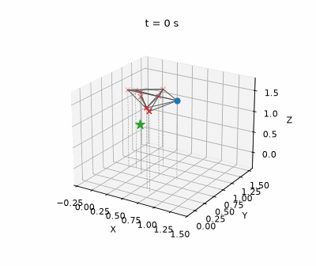
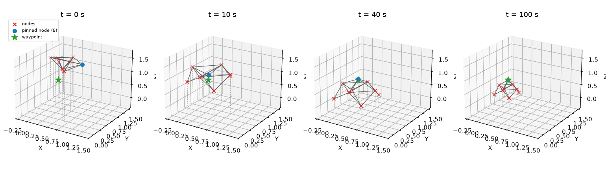
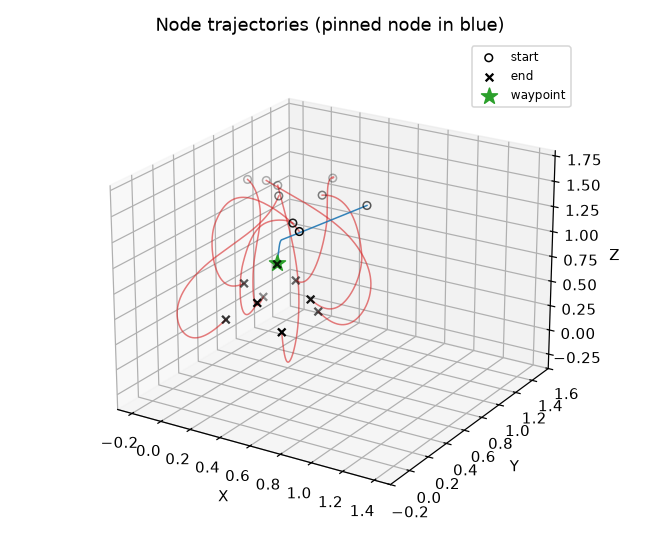

# MultiRobotSystems

> **Note:** All code in this repository (MATLAB, Python, and Simulink) was written by Kleber Cabral. The README documentation, inline code comments and the figures in `figures/` (rendered from the Python simulation's logged output) were added with AI assistance (Claude).

Multi-agent formation control experiments — consensus/distance-based controllers that drive a group of simulated nodes (robots/UAVs) into and around a target formation shape.

<p align="center">
  
</p>

## Python simulation results

A run of `python/formation_velcontrol.py` (100 s simulated). The nine nodes start at
random positions, settle into the pyramid's relative geometry within about 10 s, and are
dragged by the pinned node (blue) to the waypoint (green star). Once the pinned node is
within 0.2 m of the waypoint, the assembly stage starts: the target offsets shrink by
0.1% per step and the formation contracts.

<p align="center">
  
</p>

<p align="center">
  
</p>

## Structure

```
MultiRobotSystems/
├── matlab/
│   ├── sim_formation_vel.m           # general formation-control testbed
│   └── Auxiliar.m                    # sigma-norm/rho_h flocking helper + plotting utilities
├── python/
│   └── formation_velcontrol.py       # 3D 9-node "pyramid" formation + waypoint navigation
├── simulink/
│   └── formation_with_real_uavs.slx  # Simulink model for real UAV formation control
├── figures/                          # images from a run of the Python simulation
└── requirements.txt
```

These three pieces are related work, not interchangeable versions of each other — they're grouped by language/tool rather than treated as one canonical implementation.

## What each piece does

- **`matlab/sim_formation_vel.m`** — Implements a displacement-based formation controller (per Oh, Park & Ahn's multi-agent formation control survey, Section V-B). The active configuration is a 4-node 2D "Shape" adjacency setup; several alternate 1D/2D/3D node configurations are present but commented out for quick swapping during experimentation.
- **`python/formation_velcontrol.py`** — Simulates 9 nodes in 3D consensus-driving toward a "pyramid" target formation, with one pinned node following a waypoint path (a square loop at fixed altitude). Formation shrinks ("assembles") once the pinned node nears its next waypoint. Renders a live-updating 3D matplotlib plot each timestep.
- **`simulink/formation_with_real_uavs.slx`** — Simulink model intended for driving formation control on real UAV hardware (not reviewed/documented in detail here — open in MATLAB/Simulink to inspect blocks and I/O).

## Install (Python)

```bash
pip install -r requirements.txt
```

## Run

```bash
python python/formation_velcontrol.py
```

For the MATLAB script, open `matlab/sim_formation_vel.m` in MATLAB and run it directly; edit the `Shape` matrix (or uncomment one of the alternate `%% ...` sections) to change the node configuration. `simulink/formation_with_real_uavs.slx` should be opened in Simulink.

## Key dependencies

- Python: `numpy`, `matplotlib`, `icecream` (debug printing)
- MATLAB (no toolboxes identified as required beyond base MATLAB)
- Simulink (for the `.slx` model)

## Status

Research/experimentation code, not a packaged library — no tests, no shared interface between the MATLAB, Python, and Simulink pieces. The MATLAB script in particular is set up as a scratchpad (multiple commented-out configurations) rather than a single finished scenario. A stray MATLAB autosave file (`sim_formation_vel.asv`) was removed during cleanup — it was an editor backup, not source.

Known behaviour of the Python simulation, seen when running it for the figures
(2026-10-02):
- **No ground constraint.** The pinned node is the pyramid's apex, held at z = 0.5 m, so
  the base nodes end up below z = 0 (lowest about −0.2 m).
- **Only the first waypoint is used.** `nextwp` is never advanced, so the formation
  flies to `WP[1]` and then assembles there, instead of looping the square path.
- The live plot redraws every step, so a full run takes a few minutes.

`sim_formation_vel.m` depends on `Auxiliar.m` (in the same folder) for its collision-avoidance math — both are now present and the script should run as committed.

## License

MIT — see [LICENSE](LICENSE).
